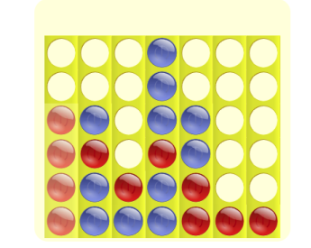

# Trabalho Prático - Jogo Ligue4
O propósito desta atividade é implementar o jogo Ligue4 utilizando os recursos de programação abordados na disciplina. A implementação deve ser realizada na linguagem Python.
O Ligue4 é jogado por dois jogadores e vence quem conseguir montar uma sequência de 4 peças na horizontal, vertical ou diagonal. A figura a seguir ilustra uma vitória do jogador com as peças vermelhas.

    

A cada jogada, o jogador escolhe em qual coluna vai empilhar sua peça. Caso a coluna esteja cheia, o jogador não pode jogar naquela coluna e deve escolher outra. Na figura acima, não é possível jogar na coluna do meio. Os jogadores jogam um de cada vez.

A sua implementação deve possibilitar que dois jogadores humanos
joguem um contra o outro e também que um jogador humano jogue contra o
computador.

<b>Início do Programa</b>

Assim que o programa inicia, solicite ao usuário se ele deseja jogar <b>Humano x Humano</b> ou <b>Humano x Computador</b>. Em ambos casos a dinâmica do jogo não muda, porém, caso o jogador queira jogar contra o computador, seu programa deve fornecer as jogadas quando for a vez do computador. Neste caso, seu programa fará sempre jogadas aleatórias porém válidas.

<b>Dinâmica do Jogo </b>

Quando o jogo começa, inicie mostrando o <b>tabuleiro vazio</b> e, a cada jogada, mostre o tabuleiro com a respectiva peça. Em seguida, solicite ao próximo jogador sua jogada e siga dessa forma até que um dos jogadores vença ou ocorra um empate.

Quando um dos jogadores fizer uma jogada vencedora, exiba uma mensagem informando qual dos jogadores venceu e encerre o programa. Em caso de empate, avise os jogadores dessa situação (ocorre empate quando encerram-se as possibilidades de jogadas e nenhum jogador venceu). Caso o jogador escolha uma jogada inválida, não realize-a, avise o jogador e solicite uma nova jogada.

A apresentação do tabuleiro, a solicitação de jogadas e toda a interação com o usuário deve ser feita em modo texto, utilizando as funções print e input.

<b> Código-fonte</b> 
Este jogo (assim como a maioria dos jogos) pode ser modelado e implementado utilizando-se de Orientação a Objetos. O ideal é que a sua implementação seja orientada a objetos, caso não seja possível, descreva no final código fonte quais seriam as classes, seus atributos, seus métodos e como os objetos interagiriam.

